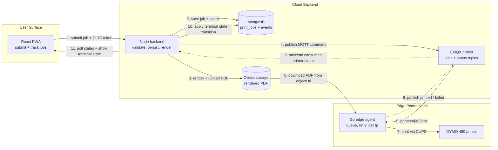

# `leftover-label-printer`

> **Inspiration:**
>
> I was tired of finding containers of food in the back of the fridge and having no idea of how old the food was; the precautionary principle would always compel me to throw the contents in the bin.
>
> Now I'm fully informed of the age of the food I inevitably throw away anyways. :)

## How it works



1. The React PWA submits a print job to the backend with an OIDC bearer token.
2. The backend validates the request, stores job state in MongoDB, renders the label PDF, and uploads it to object storage.
3. The backend publishes a printer-specific MQTT command through EMQX so the target Raspberry Pi agent can pick it up.
4. The edge agent downloads the rendered PDF, prints it through CUPS to the DYMO 450, then publishes a terminal `printed` or `failed` status through EMQX.
5. The backend consumes that printer status event, applies the guarded terminal state transition, and persists the final job state before the PWA shows it to the user.

Mermaid source lives in this README. The earlier Excalidraw asset is still available at `docs/assets/how-it-works.excalidraw.elements.json` if we want to reuse or export it later.

## Target hardware

- Raspberry Pi CM4
- Dymo LabelWriter 450 (USB thermal label printer)
  - Linux CUPS and the thermal label printer driver must be installed on the Pi.
  - Host-side installer script: `scripts/agent/install-dymo-450-driver.sh`
  - `CUPS_PRINTER_NAME` is configurable; runtime defaults target MVP queue `dymo`.
  - If installer `QUEUE_NAME` is overridden, set runtime `CUPS_PRINTER_NAME` to that same queue name.
  - Unit tests may use neutral names such as `mockPrinter`.
  - The DYMO installer script defaults to queue name `dymo` (override with `QUEUE_NAME=<name>`).

## Monorepo layout

```text
.
├── frontend/   # React PWA
├── backend/    # Node API + workers
├── agent/      # Go edge print agent
├── infra/      # Local/dev infra definitions
├── contracts/  # OpenAPI + AsyncAPI contracts
├── docs/       # Mission, architecture, security, DoD, templates
└── Makefile    # Root command entrypoints
```

## Root command contract

All service-level workflows are exposed at repository root with shared entrypoints:

- `make install`
- `make lint`
- `make test`
- `make build`
- `make smoke` (runs all of the above in sequence)

You can also run a target for a single service from root:

- `make install-frontend`
- `make lint-backend`
- `make test-agent`
- `make build-infra`

## Day-1 local workflow

1. Clone the repository.
2. Install required toolchains from `.tool-versions` (`nodejs` and `go`).
3. Run `make install` from repository root.
4. Copy each service `.env.example` file to `.env` and populate required secrets.
5. Validate env contracts with `make env-test` and `node --experimental-strip-types scripts/env/validate-env.ts`.
6. Run `make smoke` to verify command wiring.
7. Move into a service directory and run `make <target>` while iterating.

## Coding conventions

- Keep boundaries explicit: frontend/UI, backend/API-orchestration, agent/device runtime, infra/environment plumbing.
- Keep interface changes contract-first in `contracts/openapi.yaml` and `contracts/asyncapi.yaml`.
- Keep secrets out of the repository. Use `.env.example` files for variable names only.
- Prefer deterministic automation from repo root (`make ...`) and avoid hidden machine-local prerequisites.
- Use Node/TypeScript for repo-wide developer and CI tooling; keep runtime validation in each service's native language.

## Environment and secrets

- Service env contracts:
  - `frontend/.env.example`
  - `backend/.env.example`
  - `agent/.env.example`
  - `infra/.env.example`
- Secret sourcing and validation policy:
  - `docs/environment-and-secrets.md`

## Local dependency stack

- Compose stack definition: `infra/docker-compose.yml`
- Bootstrap guide: `docs/local-dependency-stack.md`
- One-command startup: `make -C infra up`

## CI guardrails

- Workflow: `.github/workflows/ci.yml`
- CI baseline docs: `docs/ci.md`

## API contract governance

- HTTP contract source: `contracts/openapi.yaml`
- MQTT contract source: `contracts/asyncapi.yaml`
- Versioning and deprecation policy: `docs/openapi-versioning-policy.md`
- MQTT versioning and deprecation policy: `docs/asyncapi-versioning-policy.md`

## Agent notes

### Migration context pack

For the cloud-connected migration plan and agent task context, read:

1. `docs/README.md`
2. `docs/mission.md`
3. `docs/architecture.md`
4. `docs/state-machine.md`
5. `docs/security.md`
6. `docs/definition-of-done.md`
7. `contracts/openapi.yaml`
8. `contracts/asyncapi.yaml`
9. `docs/templates/linear-agent-issue-template.md`

This is my first venture into the Internet of Food (Prep), and hopefully not the last.
